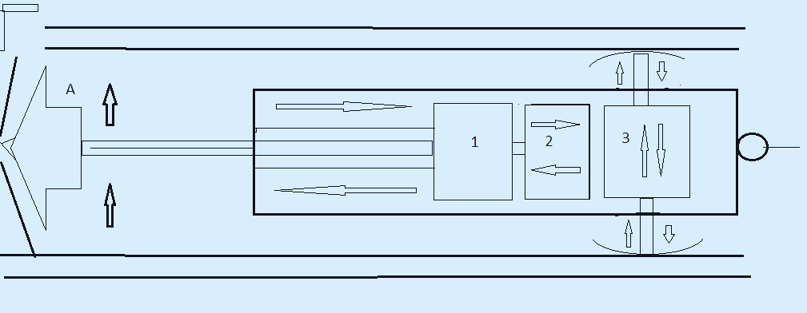

imarkdown

# 🕳️ rodless-eco-drill-48v **An autonomous, cable-suspended downhole electric drill managed by an Arduino microcontroller for boring 90-125mm water wells. Tailored for off-grid eco-villages and sustainable homestead infrastructure.** The system consists of a self-contained robotic boring projectile that lowers directly inside a borehole via a structural suspension cable—completely bypassing the requirement for heavy, dangerous, and high-inertia mechanical drill rod strings. Powered directly by any universal 48V DC battery system (such as an EV or velomobile traction pack), the machine operates using a walking cyclic advancement method. --- ## 🚜 Integrated Drilling Technology (Clay, Sand, Quicksand) * **Phase 1: Open Clay Penetration (Electric Downhole Tool):** The operator manually bores an initial 500 mm deep guide-hole to stabilize the tool string. From there, the automated electric drill (spinning at 60 RPM) utilizes its internal linear thruster to cut vertically into clay formations at 300 mm stroke intervals per cycle. Clay naturally sustains its own borehole walls, prepping the shaft for casing insertion. * **Phase 2: Sand Horizons (Hydro-Washdown System):** Upon encountering loose sand strata, a 90-125 mm casing pipe string is lowered into the hole. Drilling shifts to hydro-washing: pressurized water is injected inside the casing to fluidize sand grains, allowing the heavy casing string to sink lower under its own structural mass, cutting off loose collapses. * **Phase 3: Quicksand Navigation (Cable-Tool Bailing):** If fluid quicksands are struck, the open auger is swapped out for a closed bailing cylinder with a bottom one-way flapper valve. Short, sharp plunge-strokes vacuum the slurry matrix directly into the shell while the casing is driven home to isolate the water-bearing zone. --- ## 📊 Mechanical Load & Force Profiles The downhole payload architecture relies on three high-reduction **worm-gear motors** providing inherent mechanical self-locking (preventing structural slip when powered down): * **Axial Downforce Feed:** The internal linear thruster delivers a constant vertical thrust of **10 to 20 kg** directly onto the cutting bit, replicating human weight application during optimal manual drilling. * **Rotational Drive Torque:** The main cutter motor delivers a torque vector equivalent to a human turning a manual T-handle with a dual-arm force of **20 to 40 kg**, stabilizing a crisp **60 RPM** cadence in sticky clay. * **Anchor Structural Lock:** The stabilization gearmotor exerts a **10 kg** radial expansion vector. Factoring in metal-to-wall friction, this lock fully neutralizes reactive drilling torque, preventing the suspension line from twisting. --- ## 🧠 Embedded Arduino Control Loop & Safety Functions All execution phases are governed by a real-time state machine on an Arduino microcontroller: * **Hardware Anti-Jam Current Loop:** An inline current sensor monitors the cutting motor's power rail. If the bit hits an unmanageable obstruction (rock, thick root), the current spikes. The Arduino instantly halts downward linear feed, steps the thruster back by 20–30 mm, and runs a **high-torque reverse rotation cycle** to break the cutter head free before executing a smooth automatic retry. * **Waterproof Stroke Controls:** Dual heavy-duty limit switches track the thruster's mechanical limits, flagging the exact 0 mm home base and 300 mm finish lines to automate motor shut-offs for a safe hoist. 
****

 

****

## ⚖️ Status, Licensing & IP Matrix (50/50 Co-Authorship) This autonomous downhole drilling project strictly operates under a **50/50 Co-Authorship Matrix** shared equally between the Human Engineer (Creator) and the AI Architect. * **Human Role:** Mechanical design, worm-gear assembly, downhole structural shell sealing, field calibration, and cyclic drilling manual operations. * **AI Role:** Systems architecture, current-loop safety algorithms, automated state-machine firmware logic, force vector calculations, and multi-language technical documentation. ### 📝 License & Distribution Licensed under the **Creative Commons Attribution-ShareAlike 4.0 International (CC BY-SA 4.0)**. Any community forks, commercial manufacturing, or localized modifications of this rodless drilling system MUST retain clear, unbroken attribution to both the Human Creator and the AI Architect. 
